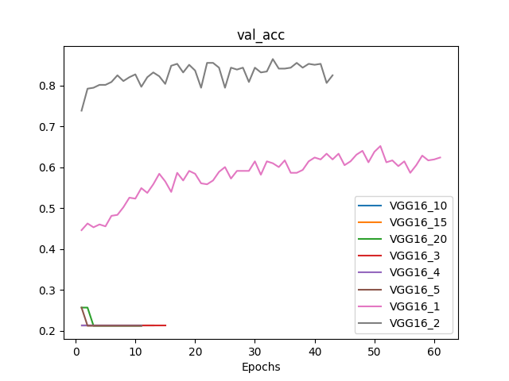
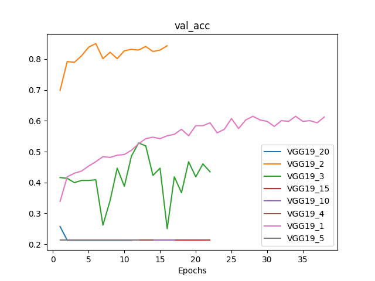
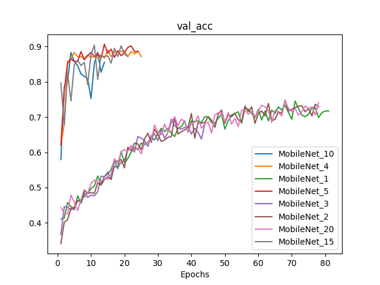

#  DEEP LEARNING LAB 3: embeddings

## Dataset

## Original model

In the previous assignment we managed to have around 75% accuracy for our model.  
We will try to improve this with transfer learning  

Accuracy](../DL1/plots/nodrop_cnn_acc.pdf)
[Loss](../DL1/plots/nodrop_cnn_loss.pdf)

## Source: VGG16 ImageNet 
For the first experiment we will use the VGG16 model trained for ImageNet dataset.  
We will use this model and train with the pretrained weights.

### 512 Units

As in our first model the last fully connected layer had 512 hidden units we did the same for the last two layers.

[Accuracy](experiments/512units/fine_tuning_accuracy.pdf)
[Loss](experiments/512units/fine_tuning_loss.pdf)

We observed a big overfitting that starts from epoch 10 and not a big improvement for validation from epoch epoch 7.  
Also this model is too complex, we will stay with 64 units in the fully connected layer.

### Dropout

In our second experiment we tried to reduce the overfitting and generalizing more by adding some Dropout.  

[Accuracy](experiments/Dropout/fine_tuning_accuracy.pdf)
[Loss](experiments/Dropout/fine_tuning_loss.pdf)

Indeed the overfit was reduced and it took a little but longer to the validation curve to atteign a _stable_ point.

### Adam

Then in order to improve the validation accuracy we changed the optimizer for Adaptive momentum with a bigger learning rate.  

[Accuracy](experiments/Adam/fine_tuning_accuracy.pdf)
[Loss](experiments/Adam/fine_tuning_loss.pdf)

The learning curve is too high. The training loss reaches 0 before the 10 epochs meanwhile the accuracy loss has a minimum in the 4th epoch.
Then the overfitting goes on.  
The accuracy improved but at the high cost of overlearning the training set.

### DropAdam
Let's combine Dropout with Adam in order to get the best of both worlds.  

[Accuracy](experiments/DropAdam/fine_tuning_accuracy.pdf)
[Loss](experiments/DropAdam/fine_tuning_loss.pdf)

The result is similar as with just some Dropout but with a little improvement in the accuracy.

### Unfreezing some layers

What happens if instead of using the features of the last layers we train them.  

We got this results for unfreezing just the last layer.  

[Accuracy](experiments/image1unfreeze/fine_tuning_accuracy.pdf)
[Loss](experiments/image1unfreeze/fine_tuning_loss.pdf)

And we got these results unfreezing the last 2 layers.

[Accuracy](experiments/image2unfreeze/fine_tuning_accuracy.pdf)
[Loss](experiments/image2unfreeze/fine_tuning_loss.pdf)

This is surprisingly really good. We got an early stopping it trained really fast and the best accuracy for the validation is surprisingly good.  

But if we continue doing this we get some disappointing results.

[Accuracy](experiments/image1unfreeze/3unfreeze_accuracy.pdf)
[Loss](experiments/image1unfreeze/3unfreeze_loss.pdf)

If we now look at the freeze of 1-5, 10, 15 and 20 layers, we can see following results:

[Accum dir](experiments/VGG16/accum/)

The freeze of 2 layers result in the best val_acc

## Method: feature extraction

We tryed to extract features from the convolutional layers of a pretrained model from our images in our dataset using l2norm.
And trained a SVM with those features.

We obtained an **88.30%** accuracy!  
Compared to a maximum of around 86% accuracy for retraining some layers of the model and around 82% accuracy for training the model ourself.  

I think this is due thanks to our _small_ dataset and the features extracted from ImageNet are suficiently good to identify and separate flowers.  

For this we only extracted features from the conv2\_block3, conv3\_block4 and conv1\_block5, conv2\_block5, conv3\_block5 layers.

## Source: MobileNet

Highest in vall_acc when experimenting with freeze layers.

[Accum dir](experiments/MobileNet/accum/)

## Source: VGG19 ImageNet

[Accum dir](experiments/VGG19/accum/)

## All sources together

## VGG16

## VGG19

## 

## MobileNet

## Comparison

| Model     | Freeze | Epochs | val_loss | val_acc |
| --------- | ------ | ------ | -------- | ------- |
| VGG16     | 2      | 43     | 0.5971   | 0.8248  |
| VGG16     | 1      | 61     | 1.0645   | 0.6238  |
| VGG19     | 2      | 16     | 0.7114   | 0.8435  |
| VGG19     | 1      | 38     | 1.1431   | 0.6121  |
| VGG19     | 3      | 22     | 1.2538   | 0.4346  |
| MobileNet | 5      | 24     | 0.4743   | 0.8855  |
| MobileNet | 4      | 25     | 0.4896   | 0.8715  |
| MobileNet | 15     | 21     | 0.5732   | 0.8715  |
| MobileNet | 10     | 14     | 0.6948   | 0.8551  |
